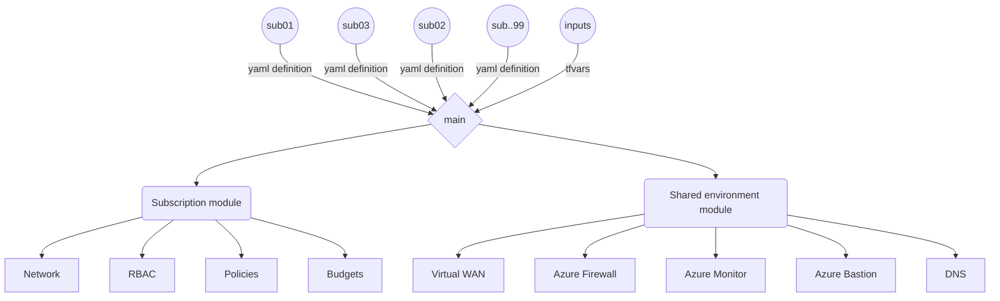
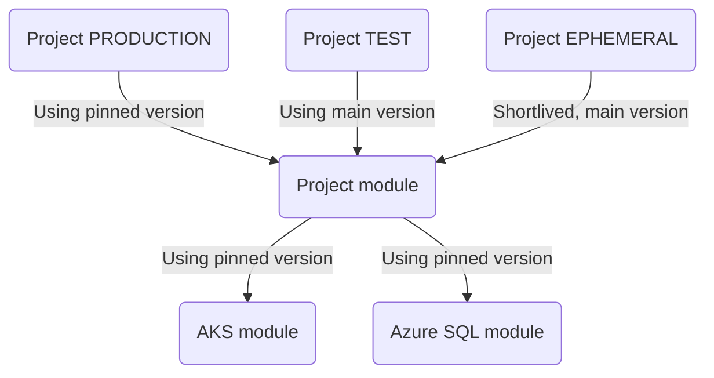
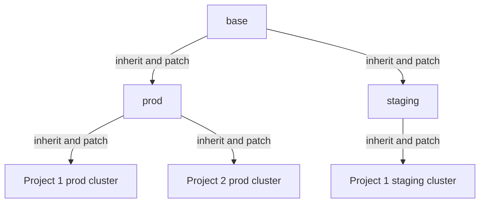
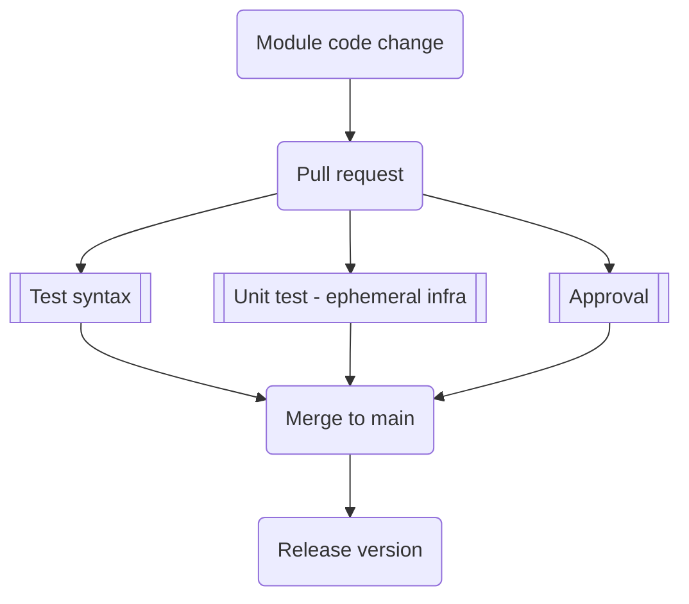
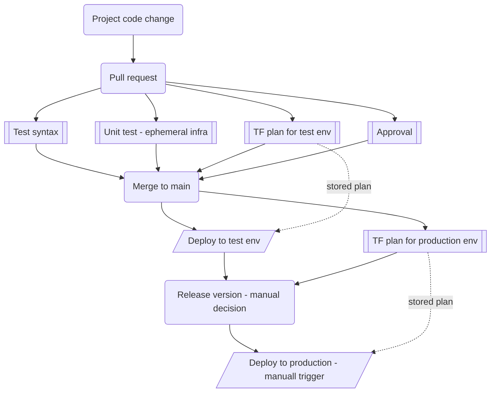

# Infrastructure as code example
This organization contains demo solution for Infrastructure as Code in Azure using Terraform (for Azure resources) and Flux v2 with Kustomize (for Kubernetes resources). Main purpose is to capture practicies around abstractions and module structure, change management or CI/CD including automated tests

## Naming conventions used in this organization
- **Tenant** is whole company, we use only one tenant here.
- **Subscription** is unit of ownership in Azure which can contain one or more environments and one or more projects. In order to learn easily in this repo I am using Resource Groups instead of subscriptions, but principles are the same, just one level higher.
- **Project** can also be understood as business application or group of applications, etc. apps that are needed to deliver e-commerce solution.
- **Environment** is specific instance of project such as dev, test or prod.

Typical setup is:
- Big projects (apps) have 2 subscriptions - one for non-prod environments including dev and test and one for prod environments including staging and prod.
- Small projects such as microsites might share single subscription.

Note: when comming from different clouds it is good to know that subscription equivalent in AWS is "account" and in Google is "project". I am using term project in different context in this repo.

## Landing zone structure
Purpose of this section is to automate shared infrastructure including central hub for routing, firewall or monitoring and creation of individual subscriptions including networking, RBAC or policies.

For simplicity authoring process is very basic, see projects and modules for more complex examples from process perspective.

Repos:
- [https://github.com/tomas-iac/landing-zone](https://github.com/tomas-iac/landing-zone)

## Project and modules structure
In order to capture knowledge, maintain consistency and keep things DRY (Do Not Repeate Yourself) we are using modules to provide opiniated abstraction of certain services such as Azure Kubernetes Service or Azure SQL Database. Such modules are then used by projects to build complete solution. 

In order to avoid copy and paste and provide ability to manage changes in projects between environments without using very complex GitFlow methods, another layer of abstraction is used to implement differences between environments.

Repos:
- [https://github.com/tomas-iac/tm-aks](https://github.com/tomas-iac/tm-aks)
- [https://github.com/tomas-iac/tm-azuresql](https://github.com/tomas-iac/tm-azuresql)
- [https://github.com/tomas-iac/project1](https://github.com/tomas-iac/project1)

## Common Kubernetes resources
To be documented and finalized later - solution is using Kustomize with multiple overlays to specialize for environments and individual clusters. Flux v2 (AKS GitOps) will be used to synchronize this with clusters.

As next step ArgoCD will be used for application deployment (TBD).

Repos:
- [https://github.com/tomas-iac/common-kubernetes](https://github.com/tomas-iac/common-kubernetes)

## Module change flow
Here is flow in GitHub Actions to manage changes is module code.

## Project change flow
Here is flow in GitHub Actions to manage changes is projects.

