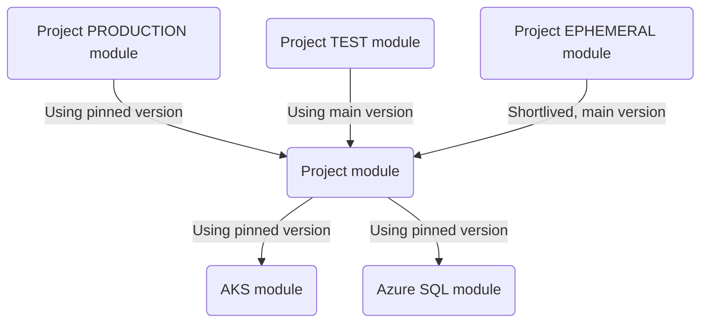
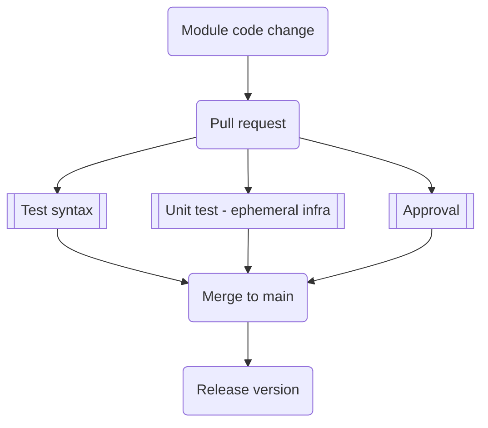
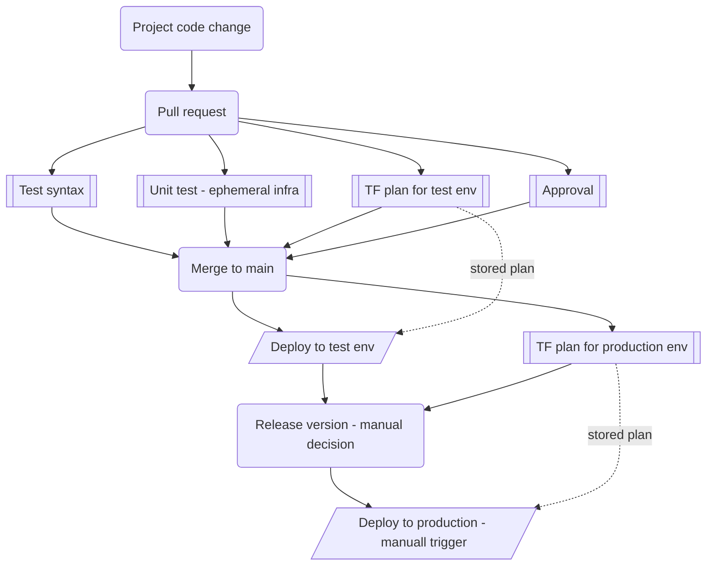

# Infrastructure as code example

## Project and modules structure

```mermaid
graph TD;
    project_prod(Project PRODUCTION module) -- Using pinned version --> project_module(Project module);
    project_test(Project TEST module) -- Using main version --> project_module(Project module);
    project_ephemeral(Project EPHEMERAL module) -- Shortlived, main version --> project_module(Project module);
    project_module(Project module) -- Using pinned version --> aks_module(AKS module);
    project_module(Project module) -- Using pinned version --> sql_module(Azure SQL module);
```

## Module change flow

```mermaid
flowchart TD
    change(Module code change) --> pr(Pull request);
    pr --> syntax[[Test syntax]];
    pr --> ephemeral[[Unit test - ephemeral infra]];
    pr --> approval[[Approval]];
    syntax --> merge(Merge to main);
    ephemeral --> merge(Merge to main);
    approval --> merge(Merge to main);
    merge --> release(Release version);
```

## Project change flow

```mermaid
flowchart TD
    change(Project code change) --> pr(Pull request);
    pr --> syntax[[Test syntax]];
    pr --> ephemeral[[Unit test - ephemeral infra]];
    pr --> tfplantest[[TF plan for test env]];
    pr --> approval[[Approval]];
    syntax --> merge(Merge to main);
    ephemeral --> merge(Merge to main);
    tfplantest --> merge(Merge to main);
    approval --> merge(Merge to main);
    merge --> deploytest[/Deploy to test env/];
    merge --> tfplanprod[[TF plan for production env]];
    deploytest --> release(Release version - manual decision);
    tfplanprod --> release(Release version - manual decision);
    release --> deployprod[/Deploy to production - manuall trigger/];
    tfplantest -. stored plan .-> deploytest[/Deploy to test env/];
    tfplanprod -. stored plan .-> deployprod[/Deploy to production - manuall trigger/];
```